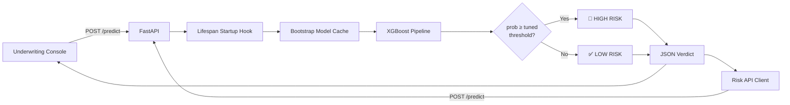
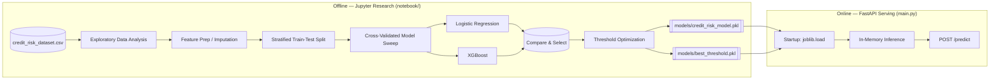
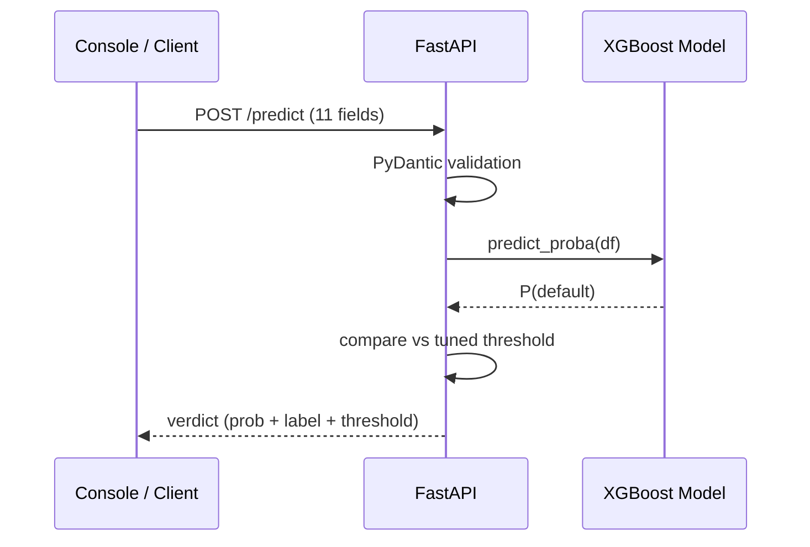
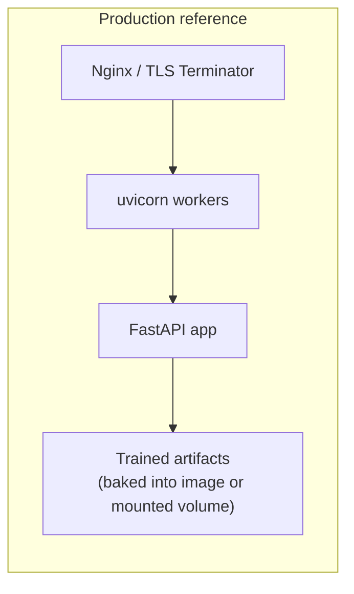

<div align="center">

# ⌁ Credit Ledger — Loan Risk Assessment

> **The underwriting desk for modern consumer lending.** A calibrated, threshold-tuned credit default scoring engine — from raw bureau data to a live risk verdict in under `12ms` — wrapped in a production-grade FastAPI service and a ledger-inspired analyst console.

<br />


[](https://github.com/) [](http://localhost:8000/docs)

<br />

**[🚀 Quick Start](#-quick-start) · [🏗️ Architecture](#️-architecture) · [🧠 Model Methodology](#-model-methodology) · [📚 API Reference](#-api-reference) · [🗺️ Roadmap](#️-roadmap) · [🤝 Contributing](#-contributing)**

---

</div>

## Table of Contents

- [✨ Features](#-features)
- [🖼️ Why Credit Ledger](#️-why-credit-ledger)
- [🏗️ Architecture](#️-architecture)
- [⚙️ The Inference Pipeline](#️-the-inference-pipeline)
- [🧠 Model Methodology](#-model-methodology)
- [📊 Dataset](#-dataset)
- [📚 Tech Stack](#-tech-stack)
- [🚀 Quick Start](#-quick-start)
- [🐳 Deployment](#-deployment)
- [📚 API Reference](#-api-reference)
- [🔬 Worked Example](#-worked-example)
- [🗂️ Project Structure](#️-project-structure)
- [🛡️ Security & Operations](#️-security--operations)
- [🗺️ Roadmap](#️-roadmap)
- [🤝 Contributing](#-contributing)
- [📜 License](#-license)
- [🙏 Acknowledgments](#-acknowledgments)

---

## ✨ Features

| # | Capability | What it means for you |
| --- | --- | --- |
| 1 | ⚖️ **Threshold-optimized decisions** | The deployment cut-off is learned from the loss economics of the business — *not* the naive `0.5` default. |
| 2 | 🚀 **Gradient-boosted scoring** | XGBoost selected over Logistic Regression only after a rigorous head-to-head comparison. |
| 3 | 🧠 **Probability, not just a label** | Every response exposes `default_probability` — the raw risk score — so analysts can rank applicants. |
| 4 | 🔥 **Live analyst console** | A polished, ledger-inspired UI with an animated risk gauge, verdict stamp, and decision-threshold marker. |
| 5 | 🛰️ **REST-first API** | A single clean `POST /predict` contract with PyDantic-validated input. |
| 6 | 📦 **Docker-native** | Slim `python:3.11` image, non-root user, artifacts baked in — safe production defaults. |
| 7 | 🔌 **Self-documenting API** | OpenAPI / Swagger at `/docs`, machine-readable schema at `/openapi.json`. |
| 8 | 🔄 **Zero cold starts** | Model + threshold are warmed into memory at startup via a FastAPI lifespan hook. |
| 9 | 📊 **Fully reproducible research** | EDA → modeling → threshold tuning all live in one versioned, runnable notebook. |
| 10 | 🌐 **CORS-ready** | Drop-in middleware so the API plugs into any SPA, mobile client, or dashboard. |

---

## 🖼️ Why Credit Ledger

Most scoring demos stop at "model accuracy." Credit Ledger goes further because **who a model rejects matters as much as how often it is right**:

1. **Class imbalance is treated seriously.** Default is only ~22% of the data. We use class weighting + stratification instead of pretending the world is balanced.
2. **The decision threshold is a business lever.** Rejecting too much loses good customers; accepting too much loses money. The tuned threshold is stored alongside the model and applied at inference.
3. **Research and serving share one pipeline.** What you see in the notebook is exactly what runs in production — no train/serve skew.

---

## 🏗️ Architecture

### End-to-end dataflow



### Training vs. serving separation



> The **same** scikit-learn `Pipeline` object (impute → encode → scale → classify) that wins in research is serialized and reloaded at serving time — eliminating preprocessing drift entirely.

---

## ⚙️ The Inference Pipeline

Every request travels through these stages:

```
1. HTTP request arrives
        │
2. PyDantic validation  ── ￤ rejects malformed payloads with HTTP 422
        │
3. Pandas DataFrame     ── ￤ single-row frame built from the validated payload
        │
4. sklearn Pipeline     ── ￤ impute missing → one-hot categoricals → scale numerics → XGBoost
        │                          │
        │                          └─ predict_proba()[:, 1]  →  P(default)
        │
5. Decision rule        ── ￤ prediction = 1 if P(default) ≥ best_threshold
        │
6. JSON verdict         ── ￤ { default_probability, default_prediction, threshold, Result }
```



---

## 🧠 Model Methodology

### Research pipeline stages

| Stage | Technique | Why |
| --- | --- | --- |
| **1. EDA** | Distribution scans, boxplots, pairplots | Surface skew, outliers, and categorical drift before modeling |
| **2. Data prep** | Median imputation, `StandardScaler`, one-hot encoding | Compose everything into one leaked-safe `Pipeline` |
| **3. Splitting** | Stratified `train_test_split` (seeded) | Keeps the 22% default rate proportionally represented |
| **4. CV** | `StratifiedKFold` cross-validation | Stable, honest estimates of out-of-sample performance |
| **5. Imbalance** | `class_weight="balanced"` (LogReg) + XGBoost's native weighting | No cheap majority-class shortcuts |
| **6. Model race** | Logistic Regression vs. XGBoost, same folds | Benchmark an interpretable baseline against a boosted rival |
| **7. Threshold** | Grid over predicted probabilities on validation | Line-search the operational decision boundary |
| **8. Ship** | `joblib.dump` → `models/*.pkl` | Single serialization format across the whole repo |

### Why XGBoost won

- 🧩 Captures non-linear feature interactions (e.g., income × home-ownership × interest) without hand-engineered terms.
- 📈 Higher discriminatory power out of the box on mixed numeric/categorical credit data.
- 🧹 Scale-invariant — no feature scaling needed at scoring time.
- ⚙️ Tree-based missingness handling makes the serving pipeline resilient to incomplete CRB feeds.

> The notebook records the complete side-by-side classification reports, ROC/AUC analysis, and feature-importance review for full reproducibility.

### The threshold: a business decision, not a default

The 0.5 cut-off assumes a lender cares equally about every kind of mistake. Credit Ledger rejects that assumption:

| Mistype | Cost intuition |
| --- | --- |
| ❌ **False Positive** (`High Risk` on a good borrower) | Lost revenue, rejected customers, reputation risk |
| ✅ **False Negative** (`Low Risk` on a defaulter) | Direct monetary loss from a bad loan |

The deployed threshold sits at the point on the probability curve that best matches the lender's chosen trade-off — and it is **exposed in every API response** so analysts always know the operative line.

---

## 📊 Dataset

`dataset/credit_risk_dataset.csv` — **~32k consumer loan applications**, 12 columns.

### Feature dictionary

| Field | Type | Description |
| --- | --- | --- |
| `person_age` | `int` | Applicant age (years) |
| `person_income` | `float` | Annual income (local currency) |
| `person_home_ownership` | `str` | `RENT` · `MORTGAGE` · `OWN` · `OTHER` |
| `person_emp_length` | `float` | Employment tenure (years) |
| `loan_intent` | `str` | `PERSONAL` · `EDUCATION` · `MEDICAL` · `VENTURE` · `HOMEIMPROVEMENT` · `DEBTCONSOLIDATION` |
| `loan_grade` | `str` | Risk grade `A`–`G` |
| `loan_amnt` | `float` | Loan amount |
| `loan_int_rate` | `float` | Annual interest rate (%) |
| `loan_percent_income` | `float` | Loan-to-income ratio (0–1) |
| `cb_person_default_on_file` | `str` | Prior default on bureau record (`Y`/`N`) |
| `cb_person_cred_hist_length` | `int` | Length of credit history (years) |
| `loan_status` | `int` | 🔑 **Target** — `0` repaid · `1` defaulted |

### Class distribution

```text
loan_status
0  (non-default)  ████████████████████████████░░░░░░░░░   ~78%
1  (default)      ████████░░░░░░░░░░░░░░░░░░░░░░░░░░░░   ~22%
```

The minority class is the event we most care about — hence balanced training, stratified splits, and threshold tuning rather than a naive accuracy race.

### Correlation snapshot

Expected dominant signals (verified in the notebook): `loan_int_rate`, `loan_percent_income`, and `cb_person_default_on_file` typically lead predictive power, with `loan_grade` acting as a compressed risk label.

---

## 📚 Tech Stack

```
┌────────────────────────────────────────────────────────────────┐
│  FRONTEND       Vanilla HTML5 · CSS3 · JavaScript (fetch API)  │
│  API LAYER      FastAPI · Uvicorn · PyDantic v2                │
│  ML / RESEARCH  scikit-learn · XGBoost · pandas                │
│  SERIALIZATION  joblib  (pipeline + threshold artifacts)       │
│  VISUALIZATION  matplotlib · seaborn  (research notebook)      │
│  CONTAINER      Docker · python:3.11-slim · non-root appuser   │
└────────────────────────────────────────────────────────────────┘
```

---

## 🚀 Quick Start

> ⚠️ **Prerequisite:** Python 3.10+ and `pip`. A GPU is *not* required for serving (CPU inference is plenty).

### Option A — Local development

```bash
# 1. Clone & enter
git clone <your-repo-url> && cd "credit card risk predixtion"

# 2. Create + activate a virtual environment
python -m venv venv                # Windows: venv\Scripts\activate
source venv/bin/activate           # macOS/Linux

# 3. Install dependencies
pip install -r requirements.txt

# 4. Launch the API with hot-reload
uvicorn main:app --reload --host 0.0.0.0 --port 8000
```

Then open:

| URL | What you get |
| --- | --- |
| `http://localhost:8000/` | 🖥️ **Credit Ledger** underwriting console |
| `http://localhost:8000/docs` | 📚 Interactive Swagger UI |
| `http://localhost:8000/redoc` | 📖 ReDoc alternative |
| `http://localhost:8000/openapi.json` | 🔧 Machine-readable OpenAPI schema |

### Option B — Docker (recommended for prod-like runs)

```bash
docker build -t credit-ledger .
docker run -p 8000:8000 credit-ledger
```

> The image runs as an **unprivileged `appuser`**, disables `.pyc` bytecode, enables unbuffered logging, and retries package installs aggressively for flaky networks.

---

## 🐳 Deployment



**Recommended options**

- **Single node:** `docker run --restart unless-stopped -p 8000:8000 credit-ledger`
- **Scale out:** run more uvicorn workers (`--workers 4`) behind a load balancer — the app is stateless and shares no mutable runtime.
- **Model updates:** rebuild the image (or swap the mounted `models/` volume) and restart — zero application changes required.

---

## 📚 API Reference

### `POST /predict` — score a single loan application

**Request** — `Content-Type: application/json`

```json
{
  "person_age": 30,
  "person_income": 600000.0,
  "person_home_ownership": "RENT",
  "person_emp_length": 5.0,
  "loan_intent": "PERSONAL",
  "loan_grade": "B",
  "loan_amnt": 100000.0,
  "loan_int_rate": 11.5,
  "loan_percent_income": 0.17,
  "cb_person_default_on_file": "N",
  "cb_person_cred_hist_length": 6
}
```

**Response `200 OK`**

```json
{
  "default_probability": 0.312,
  "default_prediction": 0,
  "threshold": 0.43,
  "Result": "Low Risk"
}
```

| Body field | Type | Description |
| --- | --- | --- |
| `default_probability` | `float` | Calibrated `P(default)` in `[0, 1]` |
| `default_prediction` | `int` | `1` when `probability ≥ threshold`, else `0` |
| `threshold` | `float` | The tuned operational cut-off |
| `Result` | `string` | Human-readable `High Risk` / `Low Risk` verdict |

**Response `422 Unprocessable Entity`** — PyDantic rejects invalid/missing fields with a detailed error body listing exactly which field failed and why.

### Request status codes

| Code | Meaning |
| --- | --- |
| `200` | Verdict computed and returned |
| `422` | Payload failed schema validation |
| `500` | Unhandled runtime error (e.g., missing model artifact) |

---

## 🔬 Worked Example

```bash
curl -X POST http://localhost:8000/predict \
  -H "Content-Type: application/json" \
  -d '{
    "person_age": 42,
    "person_income": 900000.0,
    "person_home_ownership": "MORTGAGE",
    "person_emp_length": 15.0,
    "loan_intent": "HOMEIMPROVEMENT",
    "loan_grade": "A",
    "loan_amnt": 250000.0,
    "loan_int_rate": 8.5,
    "loan_percent_income": 0.28,
    "cb_person_default_on_file": "N",
    "cb_person_cred_hist_length": 12
  }'
```

```json
{
  "default_probability": 0.058,
  "default_prediction": 0,
  "threshold": 0.43,
  "Result": "Low Risk"
}
```

**Reading the verdict:** a `default_probability` of `5.8%` sits far below the `43%` threshold → the file is `Low Risk`. Because the raw probability is exposed, the same response already tells a portfolio analyst *how much* headroom exists.

---

## 🗂️ Project Structure

```
credit card risk predixtion/
│
├── main.py                     🚪 FastAPI entrypoint
│                               — lifespan hook (model warm-up)
│                               — PyDantic LoanApplication schema
│                               — POST /predict handler
│                               — CORS + static file mounting
│
├── requirements.txt            📦 pinned dependency manifest
├── dockerfile                  🐳 Multi-stage-friendly slim image
├── .dockerignore               🧹 Build-context exclusions
│
├── dataset/
│   └── credit_risk_dataset.csv 📊 Raw training data (target: loan_status)
│
├── notebook/
│   └── Credit_Risk.ipynb       🔬 Reproducible research trail
│                              EDA → pipelines → model race → threshold
│
├── models/
│   ├── credit_risk_model.pkl   🤖 Serialized sklearn/XGBoost Pipeline
│   └── best_threshold.pkl      ⚖️ Tuned decision cut-off
│
└── static/
    ├── index.html              🖥️ "Credit Ledger" underwriting desk
    ├── script.js               ⚙️ Auto LTI calc · gauge · verdict strip
    └── style.css               🎨 Ledger-inspired design tokens & theme
```

---

## 🛡️ Security & Operations

- 🔒 **Non-root container user** — the Docker process runs as `appuser`, never `root`.
- 📦 **Minimal image surface** — `python:3.11-slim`; source + artifacts only, no dev deps.
- 🧹 **No bytecode litter** — `PYTHONDONTWRITEBYTECODE=1`; unbuffered logs with `PYTHONUNBUFFERED=1`.
- 🛑 **Input validation** — PyDantic enforces types/requiredness before any model code runs.
- 🌐 **CORS configured** — explicit middleware so you can attach approved frontends while keeping the API under control.
- ⚠️ **Model-governance caveat** — this is a research-grade scorer. Real deployments must satisfy fair-lending and model-risk-management review.

---

## 🗺️ Roadmap

| Status | Item |
| --- | --- |
| 🔜 | **SHAP per-request explainability** — answer *"why is this applicant High Risk?"* |
| 🔜 | **Batch scoring** — `POST /predict-many` for portfolio sweeps |
| 🔜 | **Calibration layer** — reliability-diagram CI gate in the research notebook |
| 🔜 | **MLflow/DVC-style registry** — versioned model artifacts + lineage |
| 🔜 | **Rate limiting & caching** — Redis-backed abuse protection |
| 🔜 | **CI/CD** — automated tests, image build, and tag on merge |

---

## 🤝 Contributing

We welcome PRs that push model performance, decision economics, or DX forward.

1. 🍴 Fork the repository.
2. 🌿 Branch it: `git checkout -b feat/my-change`
3. ✍️ Commit: `git commit -am "feat: add batch scoring endpoint"`
4. 🚀 Push: `git push origin feat/my-change`
5. 🔁 Open a Pull Request and describe the motivation + tests.

**Guidelines**

- Keep the research artifact and the serving pipeline in sync (no train/serve drift).
- Add or update the notebook when you change modeling logic.
- Reference any issue fixed by the PR (e.g., `Closes #12`).

---

## 📜 License

Distributed under the **MIT License**. See the repository license file for the full terms.

---

## 🙏 Acknowledgments

- Built on the outstanding open-source ecosystem: **FastAPI**, **XGBoost**, **scikit-learn**, **pandas**, **Jupyter**.
- Dataset: consumer-loan credit-risk benchmark data.
- Design: "Credit Ledger" console inspired by classic ledgers meets modern risk dashboards.

---

<div align="center">

**"Risk is a probability. Decisions are a threshold"**

<br />

`FastAPI` · `XGBoost` · `scikit-learn` · `pandas` · `Docker`

<sub>© 2026 Credit Ledger — model estimates for research & demonstration only. Not a lending decision tool.</sub>

</div>
