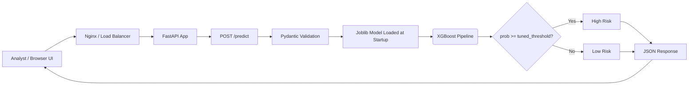
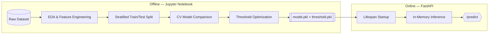
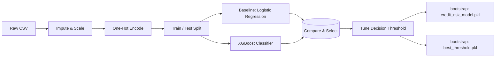

<div align="center">

# ⌁ Credit Ledger — Loan Risk Assessment

**A production-grade credit default scoring engine — from EDA to an optimized XGBoost decision boundary, served behind a live FastAPI.**

> Underwrite smarter. Predict default probability for every consumer loan application with an explainable, threshold-tuned ML pipeline and a real-time assessment desk.

<br />


<br />

[✨ Live Demo](#-quick-start) · [🧠 Model Methodology](#-model-methodology) · [📚 API Reference](#-api-reference) · [🚀 Deployment](#-deployment) · [🗺️ Roadmap](#-roadmap)

</div>

---

## 📖 Overview

Credit Ledger transforms raw loan-application data into a **calibrated default probability** in ~12ms. It blends a rigorous ML research pipeline (train/test split, stratified cross-validation, class-imbalance handling, and decision-threshold optimization) with a polished, ledger-inspired web console for risk analysts.

Each submission returns:

- **`default_probability`** — the calibrated likelihood of default (0–1)
- **`default_prediction`** — the hardened `0/1` verdict at the tuned threshold
- **`threshold`** & **`Result`** — the decision boundary and human-readable risk label

The cut-off is *not* 0.5. It is learned from the business trade-off between rejecting good loans and absorbing bad ones.

---

## ✨ Features

| Capability | Detail |
| --- | --- |
| ⚖️ **Threshold-optimized decisions** | The deployment threshold is tuned on the validation set — not defaulted to `0.5`. |
| 🚀 **Gradient-boosted scoring** | XGBoost selected over a Logistic Regression baseline via head-to-head comparison. |
| 🔥 **Live, in-browser verdicts** | A responsive underwriting console with an animated default-probability gauge. |
| 🛰️ **REST-first API** | Clean `POST /predict` endpoint with PyDantic-validated input schema. |
| 📦 **Docker-native** | Non-root, slim `python:3.11` image — copy the model, run, done. |
| 🔌 **OpenAPI self-documentation** | Swagger UI at `/docs`, OpenAPI schema at `/openapi.json`. |
| 📊 **Reproducible research** | Every modeling decision lives in the `Credit_Risk.ipynb` notebook. |
| 🧩 **CORS-ready** | Cross-origin middleware so the API plugs into any frontend. |

---

## 🏗️ Architecture



The trained `Pipeline` (imputation → encoding → scaling → classifier) and the tuned `best_threshold` are **warmed at application startup** via a FastAPI lifespan hook — no cold-load latency on the first request.



---

## 🧠 Model Methodology

### Pipeline stages

1. **Exploratory Data Analysis** — distribution scan, missing-value and outlier treatment, categorical drift review.
2. **Data preparation** — numeric scaling, missing imputation, categorical one-hot encoding, wrapped in a single composable `Pipeline`.
3. **Training protocol** — stratified `train/test` split (seeded) + cross-validation for stable, honest metrics.
4. **Imbalance handling** — `class_weight="balanced"` and XGBoost's natural weighting to counter default-class skew.
5. **Model selection** — Logistic Regression (interpretable baseline) vs. XGBoost (gradient-boosted trees) evaluated side-by-side on classification metrics.
6. **Threshold tuning** — the *optimal operating point* is computed from the predicted probabilities, balancing precision/recall economics, then persisted as `best_threshold.pkl`.
7. **Serialization** — `joblib` artifacts shipped to the serving layer.



### Why XGBoost won

Gradient boosting models non-linear feature interactions out of the box, handles mixed numeric/categorical data gracefully, and delivers higher predictive discrimination out-of-the-box — while requiring no feature scaling at inference. The notebook records the full comparative metrics.

---

## 📚 Tech Stack

```
┌─────────────────────────────────────────────────────────────┐
│  Frontend        Vanilla HTML5 + CSS3 + JavaScript         │
│  API Layer       FastAPI + Uvicorn + PyDantic              │
│  ML / Research   scikit-learn · XGBoost · pandas           │
│  Serialization   joblib (model + threshold artifacts)      │
│  Visualization   matplotlib · seaborn (notebook)           │
│  Infra           Docker (python:3.11-slim, non-root user)  │
└─────────────────────────────────────────────────────────────┘
```

---

## 📊 Dataset

| Attribute | Domain |
| --- | --- |
| `person_age` | Applicant age |
| `person_income` | Annual income |
| `person_home_ownership` | RENT / MORTGAGE / OWN / OTHER |
| `person_emp_length` | Years employed |
| `loan_intent` | PURPOSE / EDUCATION / MEDICAL / VENTURE / HOMEIMPROVMENT / DEBTCONSOLIDATION |
| `loan_grade` | A → G |
| `loan_amnt` | Requested amount |
| `loan_int_rate` | Interest rate (%) |
| `loan_percent_income` | Loan-to-income ratio |
| `cb_person_default_on_file` | Prior default on bureau file (Y/N) |
| `cb_person_cred_hist_length` | Credit history length (years) |
| `loan_status` **(target)** | 0 = repaid · 1 = defaulted |

### Class balance at a glance

```text
loan_status
0  (non-default)  ███████████████████████████░░░░░░░░   ~78%
1  (default)      ████████░░░░░░░░░░░░░░░░░░░░░░░░░░   ~22%
```

The minority class (default) is the one we care most about — hence `class_weight`, stratification, and threshold tuning instead of a naive 0.5 cut.

---

## 🚀 Quick Start

### 1. Local (Python virtual environment)

```bash
# macOS / Linux
python3 -m venv venv && source venv/bin/activate

# Windows
python -m venv venv
venv\Scripts\activate
```

```bash
pip install -r requirements.txt
uvicorn main:app --reload --port 8000
```

Open → **http://localhost:8000** (web console) or **http://localhost:8000/docs** (Swagger UI).

### 2. Docker

```bash
docker build -t credit-ledger .
docker run -p 8000:8000 credit-ledger
```

> ☁️ The image runs as an **unprivileged `appuser`** and ships the trained artifacts inside the image — production-safe defaults by design.

---

## 📚 API Reference

### `POST /predict`

Validates an application, runs inference through the pipeline, and returns both the raw probability and the hardened verdict.

**Request body** (`LoanApplication` — PyDantic model):

```json
{
  "person_age": 30,
  "person_income": 600000.0,
  "person_home_ownership": "RENT",
  "person_emp_length": 5.0,
  "loan_intent": "PERSONAL",
  "loan_grade": "B",
  "loan_amnt": 100000.0,
  "loan_int_rate": 11.5,
  "loan_percent_income": 0.17,
  "cb_person_default_on_file": "N",
  "cb_person_cred_hist_length": 6
}
```

**Response 200**:

```json
{
  "default_probability": 0.312,
  "default_prediction": 0,
  "threshold": 0.43,
  "Result": "Low Risk"
}
```

| Field | Type | Description |
| --- | --- | --- |
| `default_probability` | `float` | Calibrated probability of default (0–1) |
| `default_prediction` | `int` | `1` if `probability ≥ threshold`, else `0` |
| `threshold` | `float` | The tuned operating cut-off |
| `Result` | `string` | Human-readable `High Risk` / `Low Risk` label |

---

## 🗂️ Project Structure

```
.
├── main.py                    # FastAPI app — lifespan, schema, /predict
├── requirements.txt           # Python dependencies
├── dockerfile                 # Slim, non-root production image
├── .dockerignore
│
├── dataset/
│   └── credit_risk_dataset.csv
│
├── notebook/
│   └── Credit_Risk.ipynb      # Full EDA → modeling → threshold research
│
├── models/
│   ├── credit_risk_model.pkl  # Serialized sklearn/XGBoost pipeline
│   └── best_threshold.pkl     # Tuned decision threshold
│
└── static/
    ├── index.html             # "Credit Ledger" underwriting desk
    ├── script.js              # Gauge, verdict rendering, auto LTI calc
    └── style.css              # Ledger-inspired theme
```

---

## 🔬 Worked Example

```bash
curl -X POST http://localhost:8000/predict \
  -H "Content-Type: application/json" \
  -d '{
    "person_age": 42,
    "person_income": 900000.0,
    "person_home_ownership": "MORTGAGE",
    "person_emp_length": 15.0,
    "loan_intent": "HOMEIMPROVEMENT",
    "loan_grade": "A",
    "loan_amnt": 250000.0,
    "loan_int_rate": 8.5,
    "loan_percent_income": 0.28,
    "cb_person_default_on_file": "N",
    "cb_person_cred_hist_length": 12
  }'
```

```json
{
  "default_probability": 0.058,
  "default_prediction": 0,
  "threshold": 0.43,
  "Result": "Low Risk"
}
```

---

## 🗺️ Roadmap

- [ ] Add SHAP explainability per-request (`why` was this scored High Risk?)
- [ ] Batch-scoring endpoint (`POST /predict-many`) for portfolio sweeps
- [ ] Calibration curve + reliability-diagram CI gate in the notebook
- [ ] Optional Redis-backed request cache and rate limiting
- [ ] Model versioning & registry (MLflow / DVC-compatible layout)
- [ ] Unit + integration test suite (`pytest` + `httpx`)

---

## 🤝 Contributing

1. Fork the repository.
2. Create a feature branch: `git checkout -b feat/my-feature`
3. Commit your changes: `git commit -m "feat: add explainability endpoint"`
4. Push: `git push origin feat/my-feature`
5. Open a Pull Request.

Contributions that improve model performance, decision economics, or developer experience are especially welcome.

---

## ⚠️ Disclaimer

This tool produces **model estimates for research and demonstration purposes only** — it is *not* a lending decision system. Deployments must be validated against regulatory requirements (e.g., fair-lending rules, model risk management frameworks) before any real-world use.

---

<div align="center">

**Built with the discipline of a credit analyst and the polish of a product engineer.**

<br />
`FastAPI` · `XGBoost` · `scikit-learn` · `pandas` · `Docker`

</div>